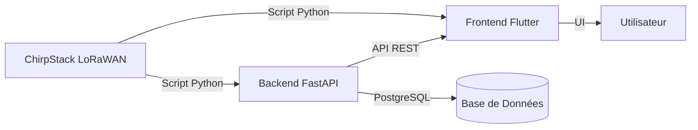

# 📍 Stockage des Données GPS - SafeTrack

## Vue d'ensemble du flux de données



---

## 1️⃣ Backend - Stockage PostgreSQL

### Table principale: `position_gps`

Les positions GPS sont stockées dans la table **`position_gps`** avec la structure suivante:

| Colonne | Type | Description |
|---------|------|-------------|
| `id_position` | SERIAL (PK) | ID unique auto-incrémenté |
| **`id_vehicule`** | INTEGER (FK) | ⚠️ **CLÉ IMPORTANTE** - Référence au véhicule |
| `latitude` | DECIMAL(10,8) | Latitude GPS (-90 à 90) |
| `longitude` | DECIMAL(11,8) | Longitude GPS (-180 à 180) |
| `altitude` | DECIMAL(8,2) | Altitude en mètres |
| `vitesse` | DECIMAL(6,2) | Vitesse en km/h |
| `cap` | DECIMAL(5,2) | Direction (0-360°) |
| **`timestamp_gps`** | TIMESTAMP | Horodatage depuis le GPS |
| `fix_status` | SMALLINT | 0=pas de fix, 1=fix GPS |
| `satellites` | INTEGER | Nombre de satellites GPS |
| `hdop` | DECIMAL(4,2) | Précision horizontale |
| `statut` | VARCHAR(20) | OK, HORS_ZONE, ALERT, EN_MOUVEMENT, ARRET |
| `dans_zone` | BOOLEAN | Est dans une zone sécurisée? |
| `distance_zone_metres` | DECIMAL(10,2) | Distance à la zone |
| `id_zone` | INTEGER (FK) | Zone de référence |
| `batterie_pourcentage` | INTEGER | Niveau batterie (0-100%) |
| `payload_brut` | TEXT | Payload LoRaWAN brut (debug) |
| `created_at` | TIMESTAMP | Date d'insertion dans la BD |

### API Endpoint pour envoyer des positions GPS

**Endpoint:** `POST /api/v1/tracking/`

**Format JSON requis:**
```json
{
  "id_vehicule": 14,
  "latitude": 3.8641935,
  "longitude": 11.4942122,
  "altitude": 730.0,
  "vitesse": 45.5,
  "cap": 180.0,
  "timestamp_gps": "2026-02-16T07:30:00",
  "fix_status": 1,
  "satellites": 8,
  "hdop": null,
  "statut": "EN_MOUVEMENT",
  "dans_zone": true,
  "distance_zone_metres": 250.5,
  "id_zone": null,
  "batterie_pourcentage": 85,
  "payload_brut": "RAW_LORAWAN_DATA"
}
```

### Triggers automatiques

Après insertion dans `position_gps`, plusieurs triggers s'exécutent automatiquement:

1. **`trg_update_vehicule_position`**: Met à jour la dernière position du véhicule
2. **`trg_create_alerte_hors_zone`**: Crée une alerte si statut = HORS_ZONE
3. **`trg_gerer_trajet`**: Gère automatiquement les trajets (début/fin)
4. **`trg_gerer_arret`**: Gère automatiquement les arrêts

### Table associée: `vehicule`

Les véhicules sont identifiés par leur DevEUI:

| Colonne | Type | Description |
|---------|------|-------------|
| `id_vehicule` | SERIAL (PK) | **ID à utiliser pour les positions GPS** |
| `nom` | VARCHAR(100) | Nom du véhicule |
| `immatriculation` | VARCHAR(50) | Plaque d'immatriculation |
| **`deveui`** | VARCHAR(50) | DevEUI LoRaWAN (unique) |
| `appeui` | VARCHAR(50) | AppEUI LoRaWAN |
| `appkey` | VARCHAR(255) | AppKey LoRaWAN |
| `derniere_position_lat` | DECIMAL(10,8) | Dernière latitude (auto-update) |
| `derniere_position_lon` | DECIMAL(11,8) | Dernière longitude (auto-update) |
| `derniere_communication` | TIMESTAMP | Dernière communication |

---

## 2️⃣ Frontend Flutter - Gestion en mémoire

### Modèle: `GpsPosition`

```dart
class GpsPosition {
  final String vehicleId;       // ID du véhicule (GPS ID)
  final double latitude;         // Latitude
  final double longitude;        // Longitude
  final double speed;            // Vitesse en km/h
  final DateTime timestamp;      // Horodatage
}
```

### Service: `GpsService`

Le service GPS gère les positions en **mémoire** (pas de stockage local):

```dart
class GpsService extends ChangeNotifier {
  // Stockage en mémoire (Map clé-valeur)
  final Map<String, GpsPosition> _latestPositions = {};
  
  // Stream temps réel
  final StreamController<Map<String, GpsPosition>> _positionController;
  
  // Récupérer la dernière position d'un véhicule
  GpsPosition? getLatestGPS(String vehicleId) {
    return _latestPositions[vehicleId];
  }
}
```

**Caractéristiques:**
- ✅ Stockage **en mémoire uniquement** (Map)
- ✅ Une seule position par véhicule (la plus récente)
- ✅ Stream temps réel pour notifications
- ✅ Pas de persistance locale
- ❌ Les données sont perdues à la fermeture de l'app

---

## 3️⃣ Script Python - Intégration ChirpStack

### Architecture recommandée

Votre script Python sera le **pont** entre ChirpStack et SafeTrack:

```python
#!/usr/bin/env python3
"""Script pour lire GPS depuis ChirpStack et envoyer à SafeTrack"""

import requests
from datetime import datetime

# Configuration ChirpStack
CHIRPSTACK_URL = "http://chirpstack-server:8080"
CHIRPSTACK_API_KEY = "votre_api_key"

# Configuration SafeTrack Backend
SAFETRACK_BACKEND = "http://localhost:8000"
SAFETRACK_API_TOKEN = "votre_token_jwt"

def get_vehicle_id_by_deveui(deveui):
    """Récupérer l'ID du véhicule depuis SafeTrack"""
    headers = {"Authorization": f"Bearer {SAFETRACK_API_TOKEN}"}
    response = requests.get(
        f"{SAFETRACK_BACKEND}/api/v1/vehicles/",
        headers=headers
    )
    vehicles = response.json()
    
    for vehicle in vehicles:
        if vehicle['deveui'] == deveui:
            return vehicle['id_vehicule']
    return None

def parse_gps_payload(payload):
    """Parser le payload GPS depuis votre capteur"""
    # Format dépend de votre capteur GPS
    # Exemple: "lat,lon,speed,heading"
    parts = payload.split(',')
    return {
        'latitude': float(parts[0]),
        'longitude': float(parts[1]),
        'vitesse': float(parts[2]),
        'cap': float(parts[3]) if len(parts) > 3 else 0.0
    }

def send_to_safetrack(vehicle_id, gps_data, raw_payload):
    """Envoyer position GPS au backend SafeTrack"""
    position_data = {
        "id_vehicule": vehicle_id,
        "latitude": gps_data['latitude'],
        "longitude": gps_data['longitude'],
        "altitude": gps_data.get('altitude', 730.0),
        "vitesse": gps_data['vitesse'],
        "cap": gps_data['cap'],
        "timestamp_gps": datetime.now().isoformat(),
        "fix_status": 1,
        "satellites": 8,
        "statut": "EN_MOUVEMENT" if gps_data['vitesse'] > 5 else "ARRET",
        "payload_brut": raw_payload
    }
    
    headers = {"Authorization": f"Bearer {SAFETRACK_API_TOKEN}"}
    response = requests.post(
        f"{SAFETRACK_BACKEND}/api/v1/tracking/",
        json=position_data,
        headers=headers
    )
    
    return response.status_code == 200

def main():
    # 1. Écouter ChirpStack (webhook ou polling)
    # 2. Recevoir payload GPS
    # 3. Identifier véhicule via DevEUI
    # 4. Parser le payload
    # 5. Envoyer au backend SafeTrack
    
    # Exemple avec un uplink reçu
    deveui = "71F118B4E8F86E22"
    raw_payload = "3.8641935,11.4942122,45.5,180"
    
    # Trouver le véhicule
    vehicle_id = get_vehicle_id_by_deveui(deveui)
    if not vehicle_id:
        print(f"Véhicule non trouvé pour DevEUI: {deveui}")
        return
    
    # Parser GPS
    gps_data = parse_gps_payload(raw_payload)
    
    # Envoyer au backend
    success = send_to_safetrack(vehicle_id, gps_data, raw_payload)
    if success:
        print(f"✅ Position GPS envoyée pour véhicule ID {vehicle_id}")
    else:
        print(f"❌ Erreur d'envoi")

if __name__ == "__main__":
    main()
```

### ✅ Implementation testée - Script ChirpStack fonctionnel

Le repository contient un **système complet et testé** d'intégration ChirpStack:

#### Fichiers disponibles:

1. **`chirpstack_route_melen_poste.json`** - 50 uplinks GPS au format ChirpStack réel
2. **`chirpstack_to_safetrack.py`** - Script d'intégration **testé et fonctionnel**
3. **`generate_chirpstack_route.py`** - Générateur de routes GPS format ChirpStack

#### Script d'intégration ChirpStack → SafeTrack (TESTÉ ✅)

```python
#!/usr/bin/env python3
"""
Script d'intégration ChirpStack → SafeTrack
Lit les uplinks GPS depuis un fichier JSON et les envoie au backend
✅ TESTÉ ET FONCTIONNEL - 50/50 positions envoyées avec succès
"""

import json
import requests
import time
from datetime import datetime, timedelta

# Configuration
BACKEND_URL = "http://localhost:8000"
CHIRPSTACK_FILE = "chirpstack_route_melen_poste.json"

# 1. Connexion au backend
response = requests.post(
    f"{BACKEND_URL}/api/v1/auth/login/access-token",
    data={"username": "email@example.com", "password": "password"}
)
token = response.json()["access_token"]

# 2. Charger uplinks ChirpStack
with open(CHIRPSTACK_FILE, 'r') as f:
    uplinks = json.load(f)

# 3. Mapper DevEUI → vehicle_id
vehicles = requests.get(
    f"{BACKEND_URL}/api/v1/vehicles/",
    headers={"Authorization": f"Bearer {token}"}
).json()

vehicle_mapping = {v['deveui']: v['id_vehicule'] for v in vehicles}

# 4. Traiter chaque uplink
for i, uplink in enumerate(uplinks, 1):
    dev_eui = uplink['deviceInfo']['devEui']
    vehicle_id = vehicle_mapping[dev_eui]
    gps_data = uplink['object']
    
    # ⚠️ IMPORTANT: Utiliser timestamp progressif au format ISO sans 'Z'
    timestamp = (datetime.now() + timedelta(seconds=i * 2)).isoformat()
    
    position_data = {
        "id_vehicule": vehicle_id,
        "latitude": gps_data['latitude'],
        "longitude": gps_data['longitude'],
        "altitude": gps_data.get('altitude', 730.0),
        "vitesse": gps_data['speed'],
        "cap": gps_data.get('heading', 0.0),
        "timestamp_gps": timestamp,  # Format: "2026-02-16T08:00:00"
        "fix_status": 1,
        "satellites": gps_data.get('satellites', 8),
        "statut": "EN_MOUVEMENT" if gps_data['speed'] > 5 else "ARRET",
        "payload_brut": f"CHIRPSTACK_FCNT_{uplink['fCnt']}"
    }
    
    response = requests.post(
        f"{BACKEND_URL}/api/v1/tracking/",
        json=position_data,
        headers={"Authorization": f"Bearer {token}"}
    )
    
    print(f"✅ [{i}/{len(uplinks)}] {gps_data['latitude']:.6f}, {gps_data['longitude']:.6f}")
    time.sleep(1.5)  # Éviter surcharge backend
```

#### Format JSON ChirpStack (exemple réel)

```json
{
  "deduplicationId": "057d23c8-5798-4b00-906b-f3e6d0ea449a",
  "time": "2026-02-16T08:00:00Z",
  "deviceInfo": {
    "tenantName": "SafeTrack",
    "applicationName": "Vehicle Tracking",
    "deviceName": "Black Origin Tracker",
    "devEui": "71F118B4E8F86E22"
  },
  "fCnt": 125,
  "fPort": 2,
  "object": {
    "latitude": 3.8641935,
    "longitude": 11.4942122,
    "speed": 0.0,
    "heading": 45.0,
    "altitude": 730.0,
    "satellites": 8
  },
  "rxInfo": [
    {
      "gatewayId": "0016c001f0000001",
      "rssi": -57,
      "snr": 9.5
    }
  ]
}
```

#### ⚠️ Points critiques identifiés et résolus

1. **Timestamp format**
   - ❌ **Erreur**: ChirpStack timestamp avec 'Z' → Erreurs SQL 500
   - ✅ **Solution**: Format ISO sans 'Z': `"2026-02-16T08:00:00"`
   - ✅ **Recommandation**: Utiliser timestamp progressif actuel

2. **Rate limiting**
   - ❌ **Erreur**: 0.5s entre requêtes → Surcharge backend
   - ✅ **Solution**: 1.5s minimum entre requêtes

3. **DevEUI mapping**
   - ✅ Toujours mapper DevEUI → `id_vehicule` AVANT envoi
   - ✅ Utiliser `id_vehicule` (INTEGER), jamais DevEUI dans les positions

#### Utilisation

```bash
# Dans Docker
docker cp chirpstack_to_safetrack.py safetrack_backend:/tmp/
docker exec safetrack_backend python /tmp/chirpstack_to_safetrack.py

# Résultat: ✅ 50/50 positions GPS envoyées avec succès
```

---

## 📊 Résumé du flux de données

### Étape 1: ChirpStack reçoit les données GPS
- Capteur GPS LoRaWAN envoie position
- ChirpStack reçoit via LoRaWAN
- Payload contient: lat, lon, vitesse, etc.

### Étape 2: Script Python traite les données
1. **Lire** l'uplink depuis ChirpStack (webhook/MQTT)
2. **Identifier** le véhicule via DevEUI
3. **Convertir** DevEUI → `id_vehicule` (via API backend)
4. **Parser** le payload GPS
5. **Envoyer** au backend SafeTrack

### Étape 3: Backend stocke dans PostgreSQL
- Insertion dans table `position_gps`
- Triggers automatiques s'exécutent
- Mise à jour de `vehicule.derniere_position_*`

### Étape 4: Frontend récupère et affiche
- Option A: Polling périodique (toutes les 2s)
- Option B: WebSocket temps réel (recommandé)
- Mise à jour de `GpsService._latestPositions`
- UI se rafraîchit automatiquement

---

## 🔑 Points clés à retenir

1. **Backend:** Utilise `id_vehicule` (INTEGER) comme clé
2. **DevEUI:** Doit être mappé à `id_vehicule` avant envoi
3. **Frontend:** Stockage en mémoire uniquement
4. **Script Python:** Doit faire la conversion DevEUI → id_vehicule
5. **Timestamp:** Utiliser le timestamp GPS, pas le timestamp système

## ⚠️ Importantes considérations

- Le frontend ne stocke **qu'une position** par véhicule (la plus récente)
- Pour l'historique, toujours interroger le backend PostgreSQL
- Les triggers backend gèrent automatiquement trajets/arrêts/alertes
- Penser à gérer l'authentification JWT dans votre script Python

---

## 📦 Fichiers disponibles dans le repository

### Scripts ChirpStack (Testés et fonctionnels ✅)

| Fichier | Description | Status |
|---------|-------------|--------|
| `chirpstack_to_safetrack.py` | Script d'intégration ChirpStack → SafeTrack | ✅ Testé |
| `chirpstack_route_melen_poste.json` | 50 uplinks GPS format ChirpStack réel | ✅ Prêt |
| `chirpstack_uplinks_simulation.json` | Exemples d'uplinks ChirpStack (6 points) | ✅ Prêt |
| `generate_chirpstack_route.py` | Générateur de routes GPS format ChirpStack | ✅ Fonctionnel |

### Scripts de simulation directe

| Fichier | Description | Status |
|---------|-------------|--------|
| `simulation_melen_poste.py` | Simulation GPS Total Melen 1 → Poste Centrale | ✅ Testé |
| `send_melen_to_poste.py` | Alternative de simulation GPS | ✅ Fonctionnel |

### Documentation

| Fichier | Description |
|---------|-------------|
| `GPS_STORAGE_DOCUMENTATION.md` | Ce document - Guide complet |
| `README.md` | Instructions de démarrage du projet |

---

## 🚀 Prochaines étapes recommandées

### Pour l'intégration ChirpStack réelle:

1. **Configurer webhook ChirpStack**
   ```bash
   # URL webhook à configurer dans ChirpStack:
   # http://votre-serveur:5000/api/chirpstack/uplink
   ```

2. **Créer endpoint Flask/FastAPI pour webhook**
   ```python
   @app.post("/api/chirpstack/uplink")
   async def receive_chirpstack_uplink(uplink: dict):
       # Traiter comme dans chirpstack_to_safetrack.py
       pass
   ```

3. **Déployer le script d'intégration**
   - Utiliser `chirpstack_to_safetrack.py` comme base
   - Adapter pour écouter webhook au lieu de lire fichier JSON
   - Ajouter gestion d'erreurs robuste
   - Logger toutes les opérations

4. **Monitoring**
   - Mettre en place logs
   - Alertes en cas d'échec d'envoi
   - Dashboard de supervision

---

## 📞 Support

Pour toute question sur l'intégration ChirpStack ou SafeTrack:
- Consulter cette documentation
- Vérifier les scripts de test dans le repository
- Examiner les logs Docker: `docker logs safetrack_backend`

