# Diagrammes d'Activité - SafeTrack

Ce document contient les diagrammes d'activité pour les cas d'utilisation identifiés, au format Mermaid.

## 1. Créer un compte
**Acteur:** Utilisateur
**Pré-conditions:** Aucune

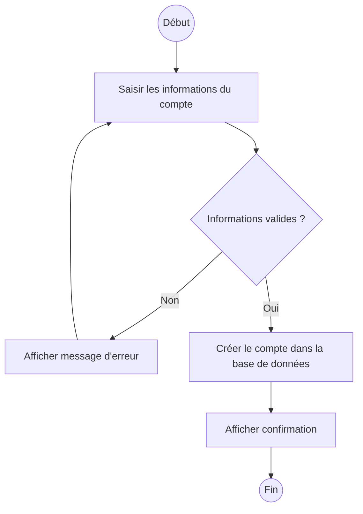

## 2. Modifier son compte
**Acteur:** Utilisateur
**Pré-conditions:** Authentification requise

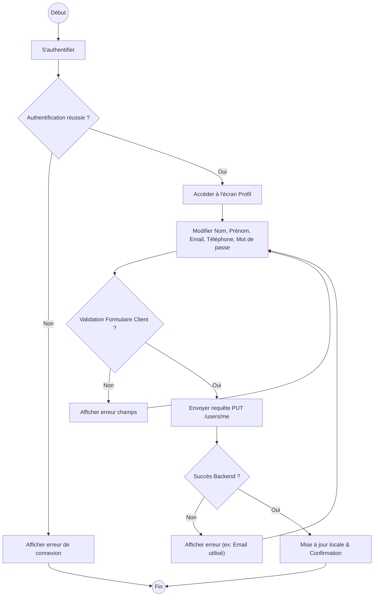

## 3. Supprimer un compte
**Acteur:** Utilisateur
**Pré-conditions:** Authentification requise

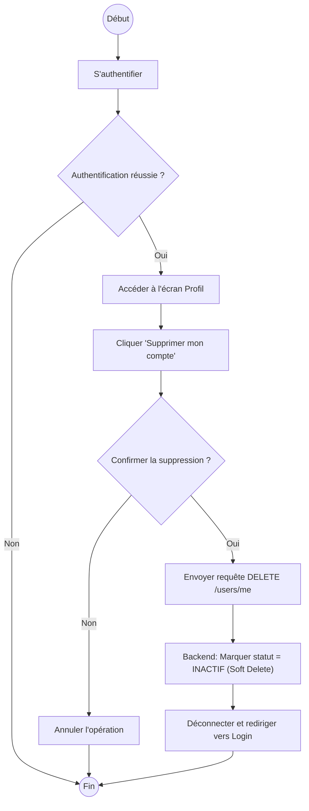

## 4. Définir une zone géographique
**Acteur:** Utilisateur
**Pré-conditions:** Authentification requise, Véhicule sélectionné

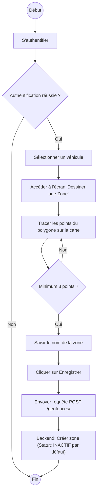

## 5. Modifier zone géographique
**Acteur:** Utilisateur
**Pré-conditions:** Authentification requise

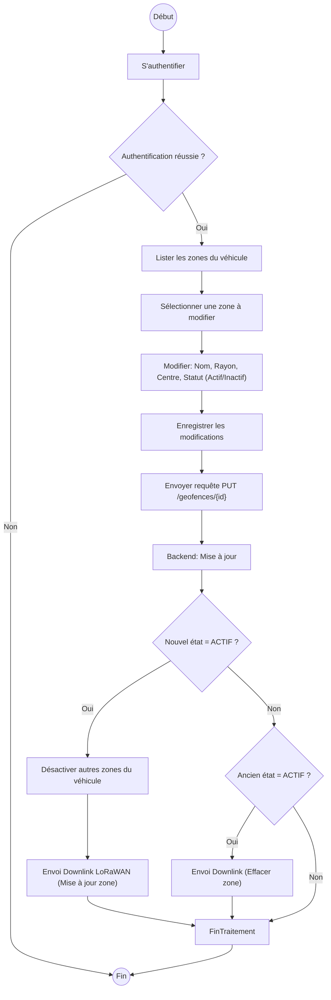

## 6. Supprimer zone géographique
**Acteur:** Utilisateur
**Pré-conditions:** Authentification requise

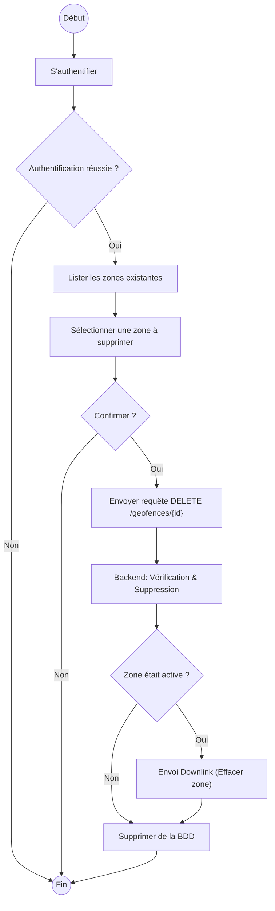

## 7. Ajouter un véhicule / Installer un dispositif
**Acteur:** Utilisateur
**Pré-conditions:** Authentification requise
**Note:** Créer un véhicule implique d'installer un dispositif (DevEUI unique requis).

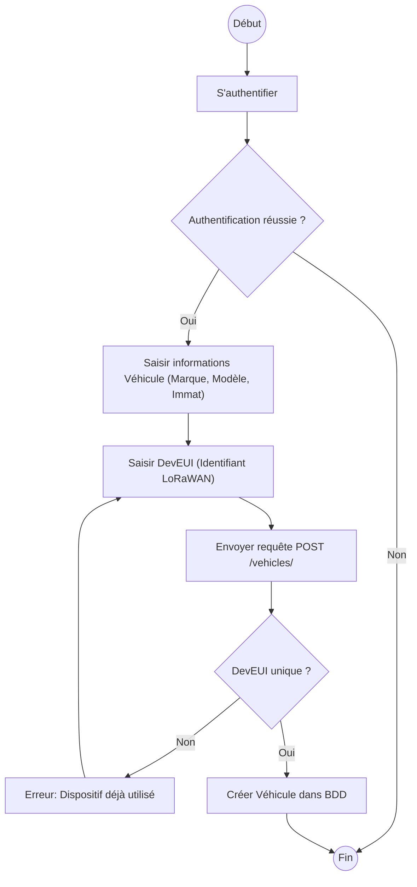

## 8. Déplacer son dispositif dans un autre véhicule
**Acteur:** Utilisateur
**Pré-conditions:** Authentification requise
**Note:** Utilise "Installer un dispositif"

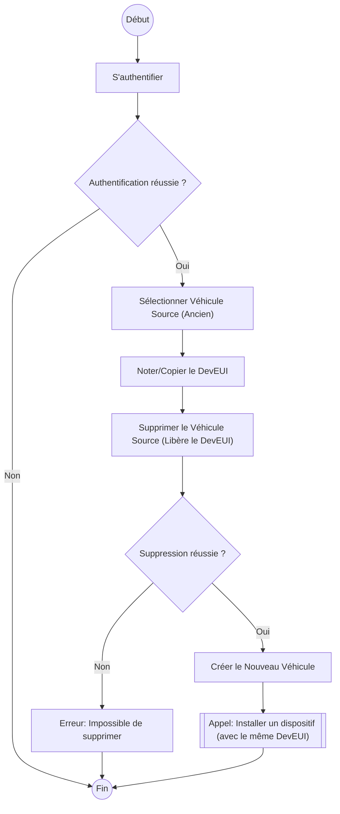

## 9. Supprimer un véhicule
**Acteur:** Utilisateur
**Pré-conditions:** Authentification requise

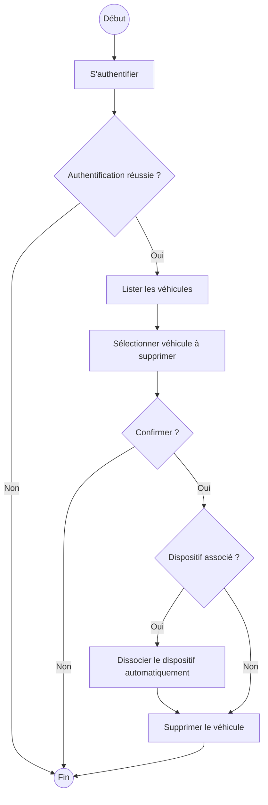

## 10. Suivre un véhicule
**Acteur:** Utilisateur, DispositifIoT
**Pré-conditions:** Authentification requise

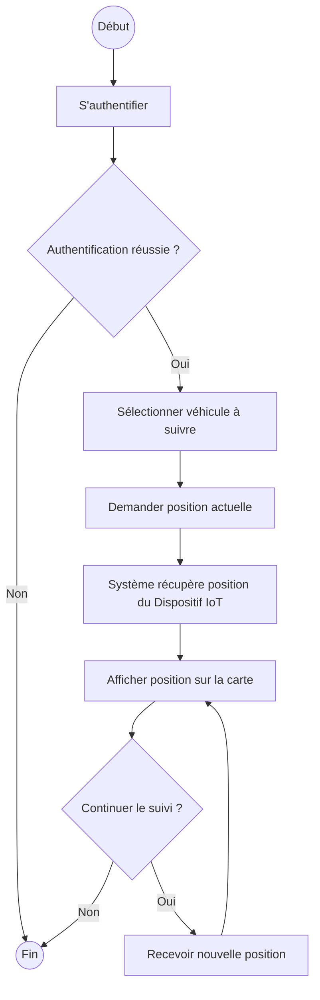

## 11. Arrêter le véhicule (Manuellement)
**Acteur:** Utilisateur, DispositifIoT
**Pré-conditions:** Authentification requise

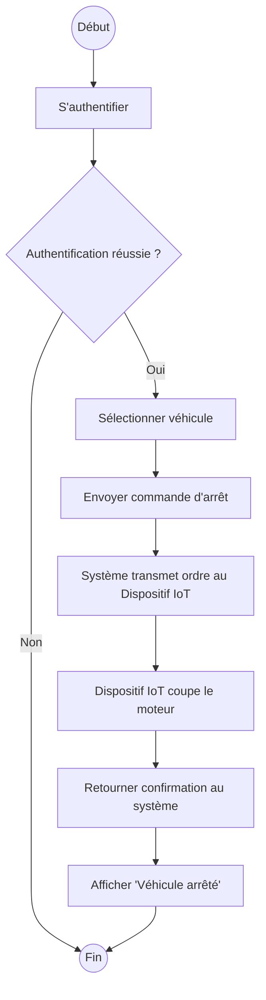

## 12. Arrêter le véhicule (Automatiquement)
**Acteur:** Système (déclenché par règle définie par Utilisateur), DispositifIoT
**Pré-conditions:** Authentification requise pour la configuration

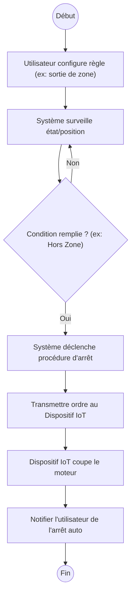
